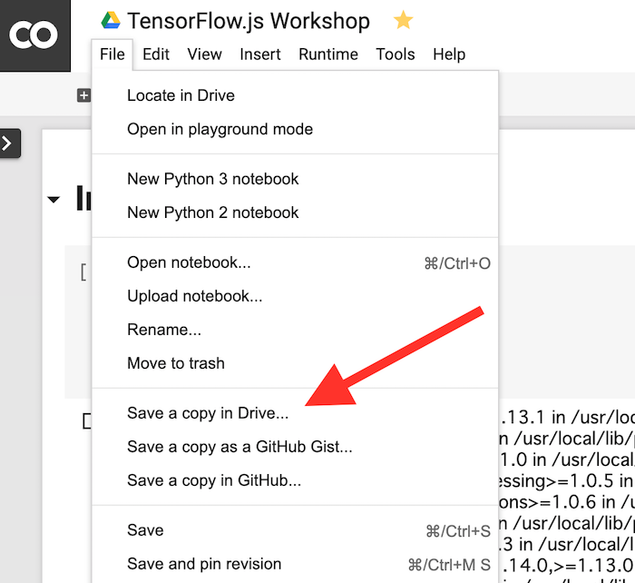

# Pretrained Model in Colab

We can train our own MobileNet in Google Colab and then import the model into TensorFlow.js web application.

# Copy the Colab into your workspace

The following Colab notebook is a template to train your own model. Please create a copy first.
https://colab.research.google.com/drive/1gRk3I3JudOl1u2ddvmSiVu1_ggS6hPvB



# Fine tune the model

You can fine tune the model with your own image. Please upload the image into Colab notebook according to the instruction.

# Download the model

Colab automatically downloads the trained model into your local machine. Please put the model into the directory your application can access.

```
$ cp ~/Downloads/mymobilenet.zip /path/to/tfjs-workshop/web/dist
$ cd /path/to/tfjs-workshop/web/dist
$ unzip mymobilenet.zip
```

Your web application will be able to load the model.